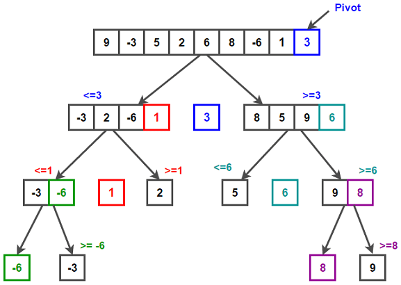

# Multithreaded Quicksort

  

1. Quicksort is an algorithm that sorts an array of numbers.
2. It is one of the most efficient sorting algorithms.
3. Our implementation makes use of recursion:
    - When we begin another recursion level, a new thread is created.
    - When we return a previous recursion level, a thread is terminated.
    - You can find more on how this algorithm works <a href="https://en.wikipedia.org/wiki/Quicksort" target="_blank"
color="cyan"> in Wikipedia</a>.
