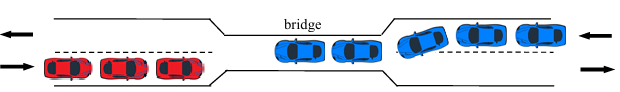

# Automated traffic regulator using fair binary Semaphores

  

 

1. Traffic Regulation via semaphores so that:
	a. 2 cars with different directions cannot be simultaneously into the
	the bridge.
	b. more than N cars are not allowed.
	c. A car cannot wait forever in order to cross the bridge
	d. Traffic should be fairly regulated, even if the flow between the
	2 directions is not equal.
2. For each car attending the bridge, a new thread is created.
2. Synchronisation is achieved WITHOUT active waiting. 