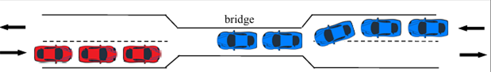

# Automated traffic regulator using fair binary Semaphores

  

 

1. Each car is a thread. The bridge itself is a thread (the main app thread).
2. Traffic Regulation requirements:
	- 2 cars with different directions cannot be simultaneously into the
	the bridge.
	- More than N cars inside the bridge are not allowed.
 	- A car cannot wait forever in order to cross the bridge
  	- Traffic should be fairly regulated, even if the flow between the 2 directions is not equal.
3. For each car attending the bridge, a new thread is created....
	- Similarly, when a car has crossed the bridge, a thread is terminated.
5. Synchronisation is achieved WITHOUT active waiting. 
