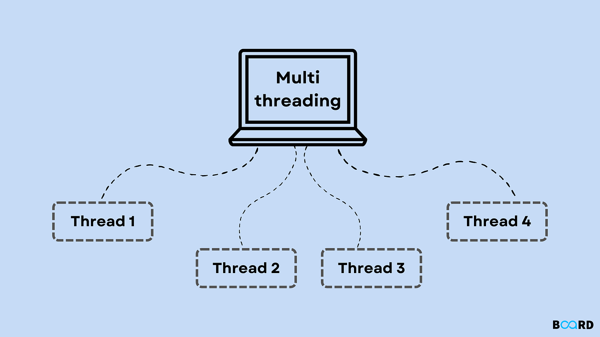

# Concurrent Programming techniques using C and pThreads library

  

1. Projects that use Pthread library in order to implement mutexes from scratch.

2. Projects that use Pthread library in order to implement "fair binary semaphores" from scratch.

3. Projects that use Pthread library in order to implement Condition Monitors and wait mechanisms.

4. A compound project (Compiler Parser), where we combine all the previous techniques.
