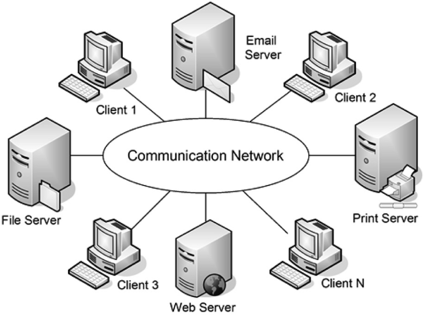

# Distributed-Computing-using-Python

  

* Folder "Distributed-Computing-using-Python" contains projects that implement several fundamental distributed computing mechanisms from scratch,
* Some of the implemented functionalities have to do with:
    - **Asynchronous Server/Client communication**
    - **Centralized group communication with Total Order messaging** 
    - **Network File System (NFS)**
    - **Distributed runtimes that support live code migration and automatic load balancing**.
